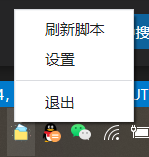
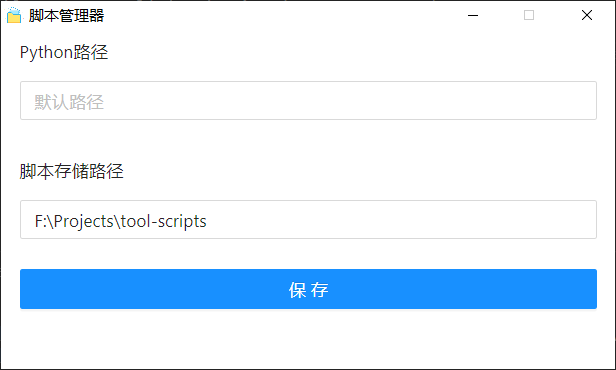
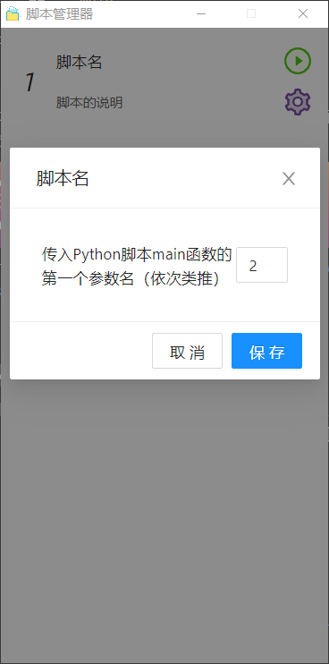

# Python脚本管理器
基于Electron React Boilerplate开发的Python脚本管理工具。

# 开发的动机
写了一些python工具脚本，给自己或者别人用的时候总是需要修改某个位置的参数，然后在控制台启动脚本。特别是对小白来说启动脚本和改参数是一件比较复杂的事情，而最直观的方式就是可以可视化的启动和设置脚本参数。

# 工程启动方法
- 安装依赖
```
npm run install
```
- 启动工程
```
npm run start
```
  
- 打包
```
npm run package
```

# 使用方法
应用程序启动后会在桌面右下角出现一个小图标，右键单击图标，可以看到context菜单：



点击设置，可以设置Python的路径，以及脚本存放的文件夹：



脚本存放路径是一个文件夹，其下每一个子文件夹代表一个工具脚本，每个工具脚本至少由一个script.json的说明文件和index.py的python入口文件组成。  
script.json文件内容如下:
```json
{
  "name": "脚本名",
  "description": "脚本的说明",
  "args": [
    {
      "name": "传入Python脚本main函数的第一个参数名（依次类推）",
      "value": "1"
    }
  ]
}
```

index.py是python脚本的入口文件，其中可以读取scripts.json中定义的参数，也可以通过print函数输出状态，demo脚本如下：

``` python
# -*- coding: utf-8 -*-
import sys
import io
import os
import time

sys.stdout = io.TextIOWrapper(sys.stdout.detach(), encoding='utf-8') # 要不然会乱码

print('正在启动', flush=True) # flush=True刷新缓冲区


if __name__ == '__main__':
    arg1 = sys.argv[1] # 与script.json文件中定义的参数数组对应
    print('参数1是{}'.format(arg1), flush=True)
    time.sleep(5)
```

正确设置脚本的存放路径和脚本后，可以左键单击小图标展开面板，这是可以看到定义的脚本，单击右侧设置按钮可以设置参数：



点击启动按钮即可启动脚本，鼠标移动到标题可以看到当前脚本中通过print打印出来的状态：


这样就方便多啦。